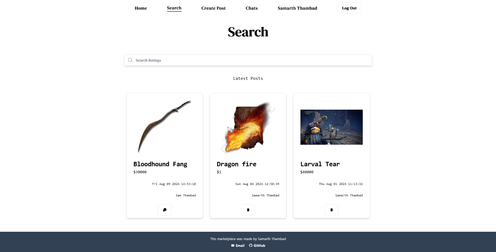
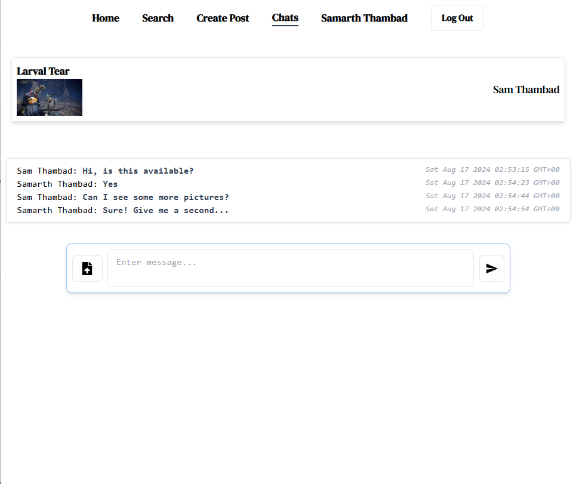
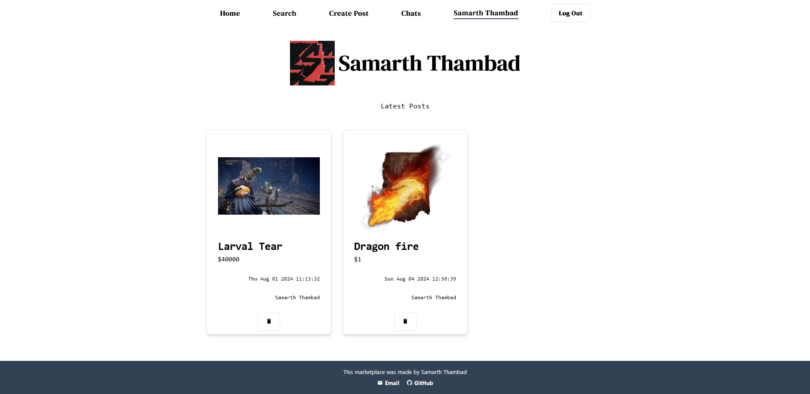

## Description

This is a online open marketplace with Realtime Chat functionality that is made using Next.Js 14,Typescript and TailwindCSS. Supabase is used for the database and Authentication.

It utilises both server and client components for efficiency and interactivity.

## Current Features
| Features | Description                                                           | Preview                                           |
| -------- | --------------------------------------------------------------------- | ------------------------------------------------- |
| Posts    | CRUD Posts, Search                                                    |    |
| Chats    | Chat with sellers/interested buyers and view all your chats in 1 page |     |
| Profile  | Manage your posts from the profile page                               |  |
- View all Chats
- Profile page
## Getting Started
[Visit](https://next-marketplace-git-main-sams-projects-2d55d388.vercel.app/)